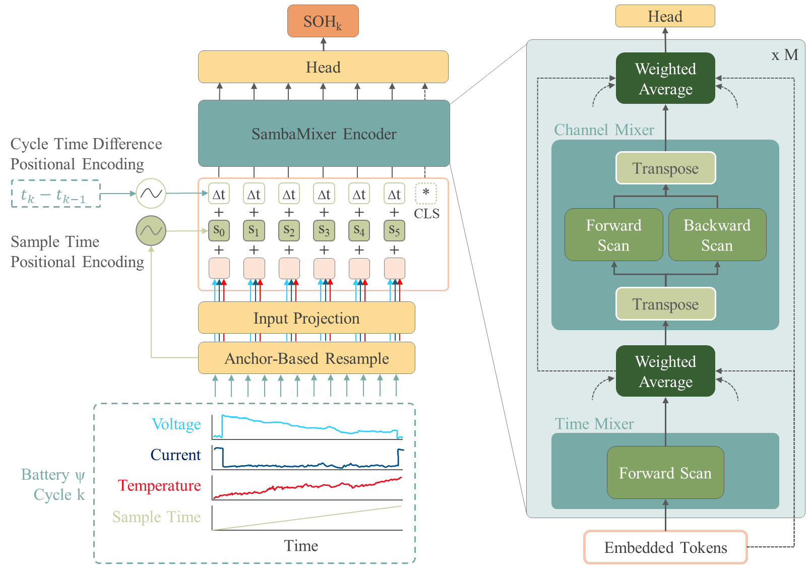
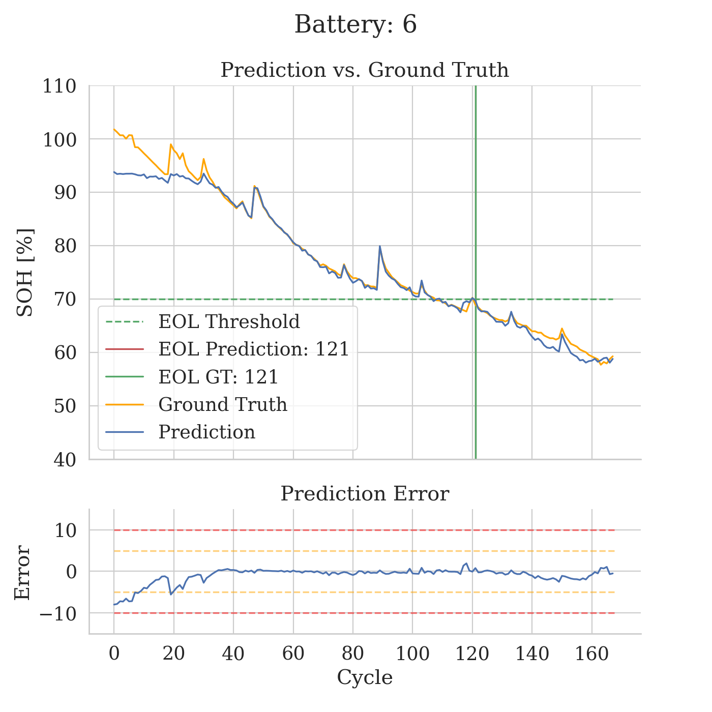
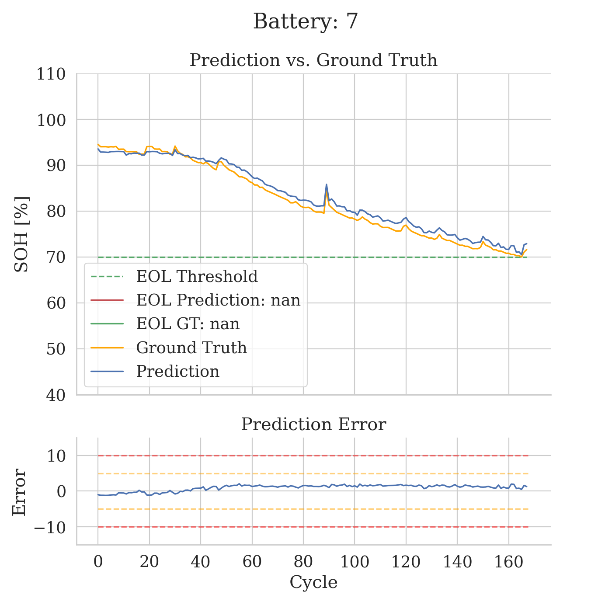
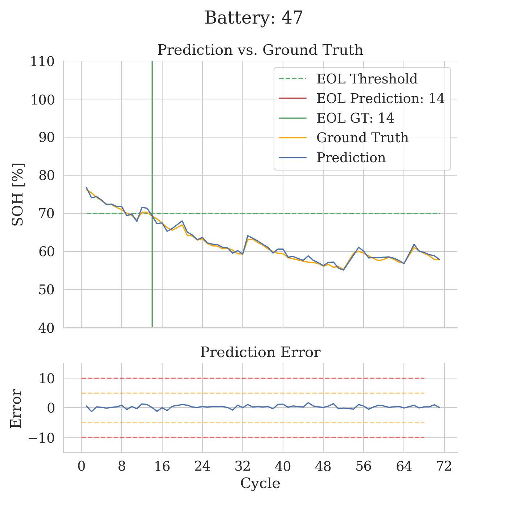

# :snake::battery: SambaMixer: State of Health Prediction of Li-ion Batteries using Mamba State Space Models

**Authors:** <br>
[Sascha Kirch](https://sascha-kirch.github.io/), [José Ignacio Olalde-Verano](https://orcid.org/0000-0001-8058-156X) , [Sergio Martín](https://orcid.org/0000-0002-4118-0234) & [Clara Pérez-Molina](https://orcid.org/0000-0001-8260-4155)

[](https://ieeexplore.ieee.org/document/10818656) [](https://arxiv.org/abs/2411.00233) [](https://paperswithcode.com/sota/li-ion-state-of-health-estimation-on-nasa-li?p=sambamixer-state-of-health-prediction-of-li) 

[[`BibTex`](#black_nib-citation)]

Oficial code base of our paper: **[SambaMixer: State of Health Prediction of Li-ion Batteries using Mamba State Space Models](https://arxiv.org/abs/2411.00233)**.

## :bulb: Contribution
1) Introducing **Mamba state space models** to the problem of **Li-Ion battery SOH prediction**.
2) Using an **anchor-based resampling** scheme to resample time signals to have the same number of samples while serving as a data augmentation method.
3) Applying a **sample time-based positional encoding** scheme to the input sequence to tackle sample jitter, time signals of varying length and recuperation effects of Li-ion batteries.

## :question: Never heard of Mamba Selective State Space models?
Here we provide free access to Sascha's series: **Towards Mamba State Space Models Images, Videos and Time Series**.
- [Part 1: Towards Mamba State Space Models for Images, Videos and Time Series](https://medium.com/towards-data-science/towards-mamba-state-space-models-for-images-videos-and-time-series-1e0bfdb5933a?sk=8aaecd0fc979e1e95ac2a8e62946064b)
- [Part 2: Structured State Space Models Visually Explained](https://medium.com/towards-data-science/structured-state-space-models-visually-explained-86cfe2757386?sk=479768bd75ecf8d410f902b7ad8c0836)
- [Part 3: Here Comes Mamba: The Selective State Space Model](https://medium.com/towards-data-science/here-comes-mamba-the-selective-state-space-model-435e5d17a451?sk=602b692eda48c19b2b2f4b0a7198bbcb)
- [Part 4: Vision Mamba: Like a Vision Transformer but Better](https://medium.com/towards-data-science/vision-mamba-like-a-vision-transformer-but-better-3b2660c35848?sk=2a84edececf20d69284ea5b03c058fa9)
- Part 5: VideoMamba
- Part 6: MAmbaMixer
- Part 7: Mamba-2

And here [free access to all his other articles](https://sascha-kirch.github.io/blog_friend_links.html)

## :fire: News
- **`2025/01/07`**: Our Paper got published in [IEEE Access](https://ieeexplore.ieee.org/document/10818656).
- **`2024/11/04`**: Code is available Now!
- **`2024/11/04`**: We release our [pre-print](https://arxiv.org/abs/2411.00233) on arxiv.

## :star: Framework



## :medal_military: Results

<table>
  <tr>
    <td> </td>
    <td></td>
    <td></td>
   </tr>
</table>

| Battery           |  Model                | MAE   | RMSE  | MAPE  |
| :---------------- | :------------------- | ----: |-----: |-----: |
| #06               |   [Mazzi et al. (2024)](https://www.sciencedirect.com/science/article/abs/pii/S0952197623013830) | 2.448 | 3.177 | 1.579 |
|                   |   SambaMixer (ours)        | **1.173** | **2.068** | **1.406** |
| #07               |   [Mazzi et al. (2024)](https://www.sciencedirect.com/science/article/abs/pii/S0952197623013830) | 1.861 | 2.252 | 1.114 |
|                   |   SambaMixer (ours)        | **1.197** | **1.285** | **1.498** |
| #47               |   [Mazzi et al. (2024)](https://www.sciencedirect.com/science/article/abs/pii/S0952197623013830) | 2.549 | 3.094 | 1.969 |
|                   |   SambaMixer (ours)        | **0.512** | **0.645** | **0.822** |


## :hammer_and_wrench: Installation
### Step 1: Docker container
first change into `./environment` directory.

Then build an image from the docker file.
> Note that you can provide different build-args here. Ones often used are:
`--build-arg HTTP_PROXY`, `--build-arg USER_ID=$UID` and `--build-arg GROUP_ID=<YOUR_GROUPID>`

```bash
docker build -t samba-mixer -f Dockerfile .
```

Create a container from the image.
```bash
docker container create --gpus all --name samba-mixer --network=host --mount=type=tmpfs,target=/dev/shm -v ~/git/sascha-kirch/samba-mixer:/home/dev_user/samba-mixer -it samba-mixer:latest
```
> Note that `--gpus` might be set to `1` to not block all existing GPUs in a shared environment and that the port mapping might be used already, so you must specify another port.

> Further note that `--mount=type=tmpfs,target=/dev/shm` is used to mount a larger filesystem to the shared memory `/dev/shm` heavily used by pytorch. Docker defaults this memory to have 64MB and even though `docker build` has `--shm-size` command, it apperently is ignored in some versions of docker. In my case, I end up with 13GB for /dev/shm after I mount the tmpfs.


To start the container in an interactive bash:
```bash
docker container start -i samba-mixer
```
Or you can connect to the container via attaching VS Code to it.

### Step 2: Install the samba_mixer package **inside the docker**
```bash
python -m pip install -e .
```

### Step 3: Install the Mamba Package **inside the docker**
```bash
cd ./third_party_packages/mamba
python -m pip install -e .
cd ..
```
> Note: It might happen that the installation crashes with an error message related to: `ImportError: connot import name 'packaging' from ....`. In that case you need to down grade setuptools via `python -m pip install -U setuptools==69.2.*`

### Step 4: Install the causal-conv-1d Package **inside the docker**
```bash
cd ./third_party_packages/causal-conv1d-1.2.2
python -m pip install -e .
cd ..
```


## :battery: Add NASA dataset to ./datasets
Only needs to be done once during the initial setup of this repo.

### Step 1: Download and uzip all files
```bash
mkdir datasets
cd ./datasets
wget https://phm-datasets.s3.amazonaws.com/NASA/5.+Battery+Data+Set.zip
unzip "5.+Battery+Data+Set.zip"
mv "5. Battery Data Set"/ nasa_batteries_orig
cd ./nasa_batteries_orig
unzip "1. BatteryAgingARC-FY08Q4.zip" -d "1. BatteryAgingARC-FY08Q4"
unzip "2. BatteryAgingARC_25_26_27_28_P1.zip" -d "2. BatteryAgingARC_25_26_27_28_P1"
unzip "3. BatteryAgingARC_25-44.zip" -d "3. BatteryAgingARC_25-44"
unzip "4. BatteryAgingARC_45_46_47_48.zip" -d "4. BatteryAgingARC_45_46_47_48"
unzip "5. BatteryAgingARC_49_50_51_52.zip" -d "5. BatteryAgingARC_49_50_51_52"
unzip "6. BatteryAgingARC_53_54_55_56.zip" -d "6. BatteryAgingARC_53_54_55_56"
cd ..
rm -rfv **/*.zip
```
> if wgeet fails, retry and add oprion ` --no-check-certificate` to the wget comand

> Note: in case those unzip commands do not work or you end up with a different file tree you need to endup with the following file tree
```
|-- samba_mixer
    |-- datasets
        |-- nasa_bateries_orig
            |-- 1. BatteryAgingARC-FY08Q4
            |-- 2. BatteryAgingARC_25_26_27_28_P1
            |-- 3. BatteryAgingARC_25-44
            |-- 4. BatteryAgingARC_45_46_47_48
            |-- 5. BatteryAgingARC_49_50_51_52
            |-- 6. BatteryAgingARC_53_54_55_56
```


### Step 2: preprocess to obtain dataset as needed by samba
```bash
cd ./scripts/utils
# Get unfiltered datasets
python convert_nasa_dataset_discharge.py

# Apply filters and pre processing as determined in the dataset analysis
python convert_nasa_dataset_discharge.py --filter
```

## :swimmer: Train and Eval Model

```bash
# Train a model using ./configs/train_config.yaml
python scripts/train.py

# Train a multiple models using ./configs/experiment_train_model_scaling.yaml
python scripts/train.py -m --config-name experiment_train_model_scaling

# Evaluate a model using ./configs/eval_config.yaml
python scripts/eval.py

# Evaluate multiple models using ./configs/eval_config.yaml
python scripts/eval.py -m

# Start all ablation training runs
sh scripts/start_ablations.sh

# Start all experiment training runs
sh scripts/start_experiments.sh
```
> NOTE: Before you can eval the models, make sure to copy the checkpoint paths into the respect eval configs.

## :chart_with_upwards_trend: Experiment Logging
We use tensorboard to log experiements. You can either install a Tensorboard plugin within VS code or start the tensorboard via the CLI

```bash
tensorboard --logdir <PATH_TO_LOGS>
```

## :warning: Trouble Shooting

### Running out of space in the Dev container

#### Delete Temp Build Files
You can delete the build files of `./third_party_packages/mamba/build` and `./third_party_packages/causal-conv1d-1.2.2/build` since the built so-file is copied into the root of mamba and the build files and temp files are not cleaned automatically by mamba


## :black_nib: Citation

If you find our work helpful for your research, please consider citing the following BibTeX entry.

```bibtex
@ARTICLE{olalde_kirch_sambamixer_2025,
  author={Olalde-Verano, José Ignacio and Kirch, Sascha and Pérez-Molina, Clara and Martín, Sergio},
  journal={IEEE Access}, 
  title={SambaMixer: State of Health Prediction of Li-Ion Batteries Using Mamba State Space Models}, 
  year={2025},
  volume={13},
  number={},
  pages={2313-2327},
  keywords={Lithium-ion batteries;Predictive models;Transformers;Temperature measurement;Discharges (electric);Voltage measurement;Lithium;Battery charge measurement;State of charge;NASA;Li-ion battery;mamba;state space model;state of health prediction;multivariate time series;deep learning},
  doi={10.1109/ACCESS.2024.3524321}}


```
